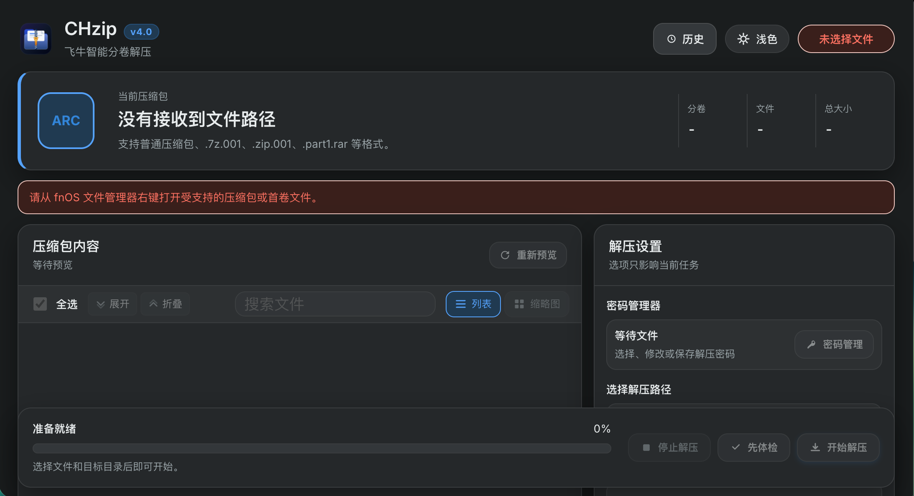
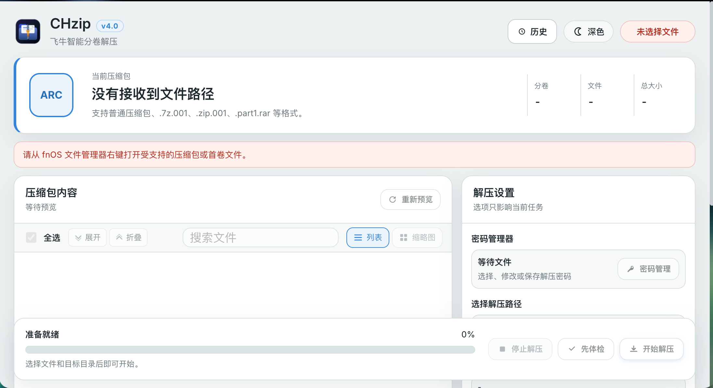
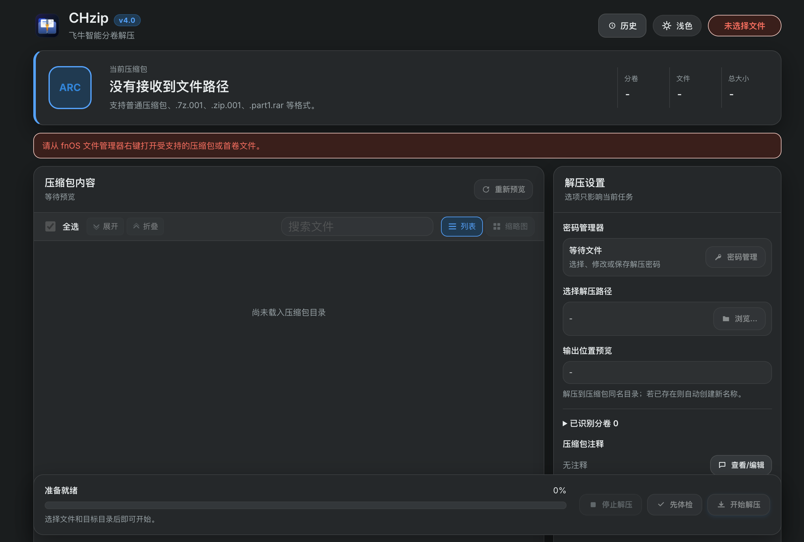
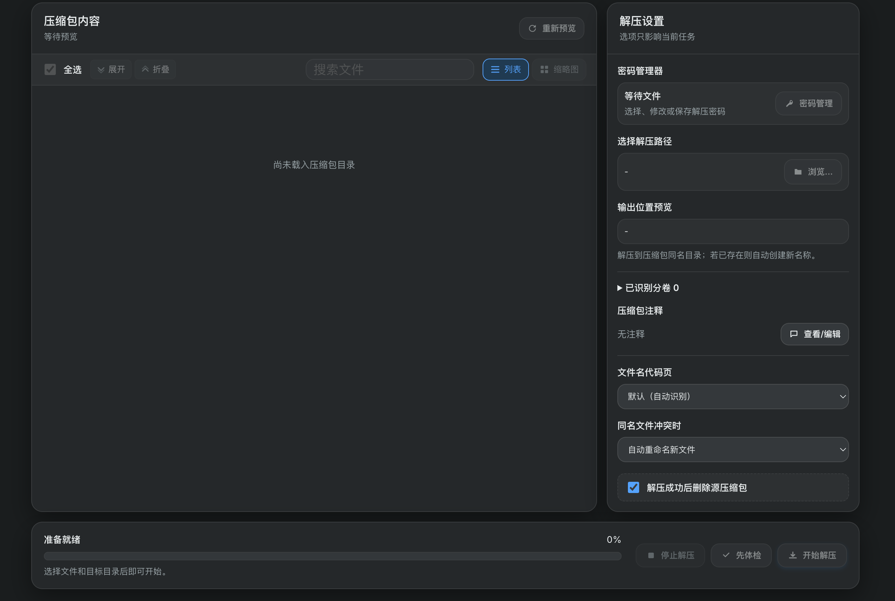

<div align="center">


# CHzip · 飞牛智能分卷解压

面向 **fnOS（飞牛私有云）文件管理器右键场景**的专业压缩包处理工具 —— 解压 · 分卷 · 选择性解压 · 文件预览 · 密码管理，一键完成。

[](https://github.com/chanhuan1/CHzip/releases)
[-2786dc?style=flat-square)]()
[](https://github.com/chanhuan1/CHzip/stargazers)
[](https://github.com/chanhuan1/CHzip/forks)
[](https://github.com/chanhuan1/CHzip/issues)
[](LICENSE)

**⭐ 觉得好用就点个 Star，是对作者最大的支持！**

[](https://chanhuan.dpdns.org/)

> 💡 **新手推荐**：访问 [**chanhuan.dpdns.org**](https://chanhuan.dpdns.org/) 查看图文版介绍页 —— 界面实测截图、双架构下载中心、安装避坑指南与常见问题，一站式更快上手。

在文件管理器里选中压缩包 → **右键 → 使用 CHzip 打开** → 点「开始解压」。

</div>

---

## 📸 界面截图

| 深色主题 | 浅色主题 |
| :-: | :-: |
|  |  |
|  |  |

## ✨ 功能特性

**格式与分卷**
- 主流格式全覆盖：`7Z` `ZIP` `RAR` `TAR` `GZ` `BZ2` `XZ` `ZST` `CAB` `ISO` `ARJ` `LZH` `CBZ` `CBR` `EPUB` `WIM` `DMG` 等；`tar.gz`/`tar.bz2`/`tar.xz`/`tar.zst` 等单文件压缩自动识别。
- **分卷原生支持**：`.7z.001`、`.zip.001`、通用 `.001`、zip 传统分卷 `.z01`、RAR 新式 `.part1.rar` 与旧式 `.r00` **自动合并**，缺卷即时提示。

**易用体验**
- 智能文件树预览：搜索过滤、勾选部分文件做**选择性解压**。
- **多代码页**：UTF-8 / GBK / Big5 / Shift-JIS / 韩文，国产软件常见乱码不再是问题。
- **免解压预览**：文本与代码（语法高亮 + 行号）、图片直读，加密包内文件也支持。
- **深色模式**：自动跟随系统，可手动切换。
- **解压进度**：实时百分比 + 当前文件 + **预计剩余时间**，随时**取消**，失败自动清理半成品目录。
- **压缩包注释**：查看与编辑 ZIP / 7Z 注释。
- **密码管理器**：本地保存常用解压密码，按需快速填入。
- **内置诊断**：一键生成脱敏诊断报告，权限问题不求人。

**🔒 安全设计**
- 路径越权防护（目录遍历 / 绝对路径 / 危险字符拦截）+ 授权目录白名单。
- 临时密码文件用后即焚（多次随机覆写再删除）；任务前后源文件指纹校验。
- 诊断日志自动脱敏，按请求 ID 追踪。

---

## 🚀 快速开始

1. 在飞牛应用中心手动安装 `CHzip_4.0_<架构>.fpk`（x86_64 / arm64）。
2. 文件管理器右键压缩包（分卷选中首卷即可）→「使用 CHzip 打开」。
3. 预览目录 → 选择目标路径 → 点「开始解压」。

> **权限提示**：请在 fnOS「应用设置」给 CHzip 授予源文件与目标共享目录的**读写**权限。
>
> 📖 更多图文细节（界面实测、分卷与乱码处理、FAQ）见在线介绍页：[https://chanhuan.dpdns.org/](https://chanhuan.dpdns.org/)

## ⭐ Star 统计

喜欢这个项目的话，欢迎点右上角 **Star** 并分享给身边用飞牛的伙伴～
## Star History

<a href="https://www.star-history.com/">
 <picture>
   <source media="(prefers-color-scheme: dark)" srcset="https://api.star-history.com/chart?repos=chanhuan1/CHzip&type=date&theme=dark&legend=top-left&sealed_token=RVnoCTXiI1u6i9Hfsw0kRYN2Mjp-oK6_60JTg4kCzxNxryDDHin-UVO7rIzJGNH_QV1e6ygGGdRD4PP941Ughveuc4xokAQm7zTfzOVsJb3wk4_j5Fp4TQ" />
   <source media="(prefers-color-scheme: light)" srcset="https://api.star-history.com/chart?repos=chanhuan1/CHzip&type=date&legend=top-left&sealed_token=RVnoCTXiI1u6i9Hfsw0kRYN2Mjp-oK6_60JTg4kCzxNxryDDHin-UVO7rIzJGNH_QV1e6ygGGdRD4PP941Ughveuc4xokAQm7zTfzOVsJb3wk4_j5Fp4TQ" />
   
 </picture>
</a>

## 🧩 技术架构

- **后端**：Node.js ≥ 22 · CGI-per-request · 零运行时依赖。
- **前端**：原生 JavaScript（IIFE），无框架、无构建步骤。
- **解压引擎**：内置 7-Zip（`7zzs`），按架构分发 `linux-x64` / `linux-arm64`。
- **任务模型**：后台 detached worker + 文件态任务（排队 → 运行 → 成功/失败），支持取消与跨页面续看。
- **打包**：fnOS FPK（`scripts/build-fpk.js`，需 `fnpack`）。

```
CHzip/
├── app/
│   ├── server/              # Node.js CGI 后端（api.js + lib/）
│   ├── ui/                  # CGI 桥接（index.cgi / api.cgi）
│   ├── www/                 # 前端静态资源（js / css / fonts）
│   └── vendor/7zip/         # 内置 7zzs（构建时按架构剥发）
├── cmd/                     # fnOS 生命周期脚本
├── config/                  # 应用配置（privilege / resource）
├── scripts/                 # 构建与发布脚本
├── tests/                   # node --test 单元测试
├── docs/images/             # 文档截图
├── manifest                 # fnOS 应用清单
└── API.md                   # CGI API 文档
```

---

## 🛠️ 开发 / 构建 / 测试

```bash
npm test                 # node --test，418 个用例
node --check app/server/api.js   # 语法检查
node scripts/build-fpk.js        # 构建 dist/*.fpk（双架构，需 fnpack）
node scripts/audit-fpk.js        # 发布审计（校验和/版本/架构/搜索特性）
```

> 推送与 PR 会自动跑 `node --check` + `npm test`（见 `.github/workflows/ci.yml`）。
> `audit-fpk` 依赖 `dist/*.fpk` 产物，因此不在 CI 里跑。

> 说明：单元测试通过依赖注入运行；内置 `7zzs` 为 Linux ELF，请在目标 fnOS 环境做真机回归。

## 📄 文档

- [API 文档](API.md)：CGI 端点、错误码与数据结构。
- [CONTRIBUTING](CONTRIBUTING.md)：参与贡献指南。

## ⚖️ 许可与致谢

本项目基于 [GNU GPL-3.0](LICENSE) 开源，源自 [xinZip](https://github.com/ff-xin/xinZip) 及[飞牛论坛原帖](https://club.fnnas.com/forum.php?mod=viewthread&tid=64284&highlight=)继续开发。内置 7-Zip（LGPL）与 Inter 字体（SIL OFL）遵循各自上游许可证。
